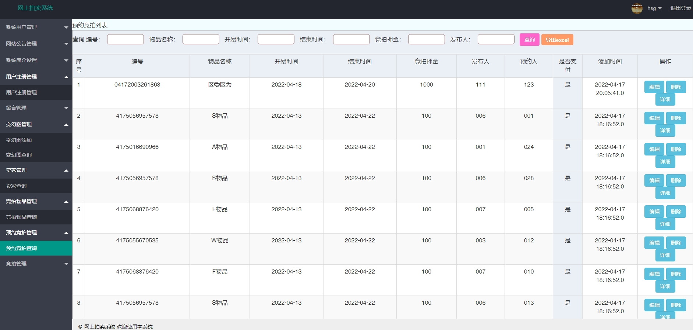

基于SSM的网上拍卖系统+论文示例参考
# 1.项目介绍
- 系统角色：管理员、卖家、买家
- 功能模块：用户管理、卖家管理、公告管理、竞拍物品管理、预约竞拍管理、竞拍管理等
- 技术选型：SSM，jsp等
- 测试环境：idea2024，jdk1.8，tomcat8，navicat等
- 测试流程：卖家添加竞拍物品，买家预约竞拍，支付押金，开始竞拍，时间截止后，管理员后台审核，审核后停止竞拍
# 2.项目部署
- 创建数据库，导入sql
- 通过idea打开项目（已经通过idea重构过项目，直接打开即可），根据本地数据库-环境配置src/applicationContext.xml 18-21行；src/com/util/db.java 22-23,33-34行
- 配置tomcat并启动
- http://localhost:8080/ 管理员账号密码：hsg、hsg，卖家和买家的账号密码可以查看相关的表，或者自行注册
# 3.项目部分截图

# 4.获取方式
[戳我查看](https://gitee.com/aven999/mall)
